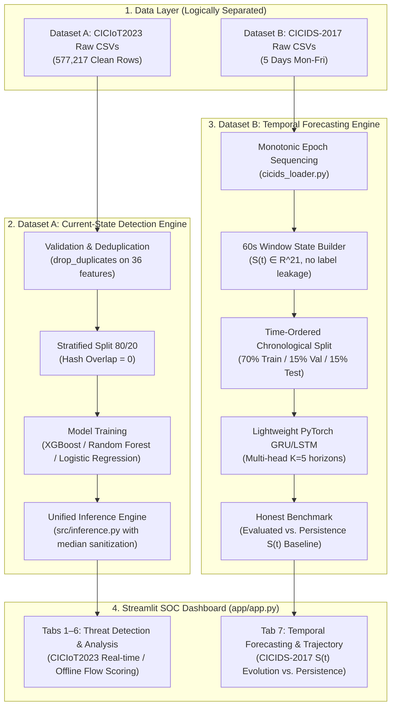

# AI Network Intrusion Detection & Temporal Threat Forecasting

[](https://www.python.org/)
[](#disclaimer)
[](https://streamlit.io/)
[](https://pytorch.org/)
[](https://xgboost.readthedocs.io/)

A production-grade machine learning system combining **current-state network intrusion classification** with **temporal network-state forecasting**, verified with strict data-leakage controls and honest baseline benchmarking.

---

## 📌 Repository Metadata

- **Description**: Dual-pipeline AI Network Intrusion Detection (CICIoT2023, 79.9% XGBoost) & Temporal Network Attack Forecasting (CICIDS-2017, GRU/LSTM) with an interactive SOC Streamlit dashboard.
- **Topics**: `intrusion-detection-system`, `network-security`, `cybersecurity`, `machine-learning`, `xgboost`, `pytorch`, `time-series-forecasting`, `ciciot2023`, `cicids2017`, `streamlit`

---

## 📖 Overview

Modern Security Operations Centers (SOCs) face two distinct operational challenges:
1. **Current Threat Detection ($X_t \to y_t$)**: Rapidly classifying current network traffic flows as benign or malicious across multi-class attack categories.
2. **Predictive Threat Forecasting ($S_{t-W:t} \to S_{t+1:t+K}$)**: Anticipating network state evolution and attack escalation $K$ steps into the future before volumetric impacts saturate defenses.

This repository implements a **dual-pipeline architecture** addressing both challenges using benchmark cybersecurity datasets:
- **Dataset A (CICIoT2023)**: Powers the **Current-State Detection Engine** across 36 flow features and 9 attack categories using XGBoost, Random Forest, and Logistic Regression models.
- **Dataset B (CICIDS-2017)**: Powers the **Temporal Network-State Forecasting Engine**, tracking a 21-dimensional network state vector $S(t)$ over 60-second windows and evaluating multi-step lookahead predictions against rigorous persistence baselines.

> [!IMPORTANT]
> **Dataset Separation**: Dataset A and Dataset B serve logically distinct purposes and are **not** combined or claimed to generalize across domains. Dataset A evaluates per-flow feature classification; Dataset B evaluates continuous multi-day temporal traffic progression.

---

## 🏗️ Architecture



---

## 🛡️ Dataset A: CICIoT2023 Current-State Detection

Dataset A classifies individual flow feature vectors into normal traffic or 8 operational attack classes (mapped from 34 granular IoT attack labels):

1. **Benign**: Legitimate traffic (`BENIGN`)
2. **DDoS**: Distributed Denial of Service (`DDOS-ICMP_FLOOD`, `DDOS-UDP_FLOOD`, `DDOS-TCP_FLOOD`, `DDOS-SLOWLORIS`, etc.)
3. **DoS**: Denial of Service (`DOS-UDP_FLOOD`, `DOS-TCP_FLOOD`, `DOS-SYN_FLOOD`, `DOS-HTTP_FLOOD`)
4. **Mirai**: Botnet activity (`MIRAI-GREETH_FLOOD`, `MIRAI-UDPPLAIN`, `MIRAI-GREIP_FLOOD`)
5. **Recon**: Scanning & host discovery (`RECON-HOSTDISCOVERY`, `RECON-OSSCAN`, `RECON-PORTSCAN`, `RECON-PINGSWEEP`)
6. **Spoofing**: Identity deception (`MITM-ARPSPOOFING`, `DNS_SPOOFING`)
7. **WebAttack**: Web vulnerabilities (`XSS`, `SQLINJECTION`, `COMMANDINJECTION`, `BROWSERHIJACKING`, `UPLOADING_ATTACK`)
8. **BruteForce**: Password attacks (`DICTIONARYBRUTEFORCE`)
9. **OtherAttack**: Backdoors and misc attacks (`VULNERABILITYSCAN`, `BACKDOOR_MALWARE`)

### Predictive Features (36)
`Header_Length`, `Protocol Type`, `Time_To_Live`, `Rate`, `fin/syn/rst/psh/ack/ece/cwr_flag_number`, `ack/syn/fin/rst_count`, `HTTP`, `HTTPS`, `DNS`, `Telnet`, `SMTP`, `SSH`, `IRC`, `TCP`, `UDP`, `DHCP`, `ARP`, `ICMP`, `IGMP`, `Tot sum`, `Min`, `Max`, `AVG`, `Std`, `IAT`, `Number`, `Variance`.  
*(Redundant features `IPv`, `LLC`, `Tot size` were removed during feature selection).*

---

## 🔮 Dataset B: CICIDS-2017 Temporal Forecasting

Dataset B formulates threat prediction as an authentic time-series problem: given the past $W$ windows of network telemetry $S(t-W+1), \dots, S(t)$, forecast future state $S(t+1), \dots, S(t+K)$ and future attack probabilities.

- **Window Size ($W$)**: 10 windows (10 minutes of history at 60s/window).
- **Forecast Horizon ($K$)**: 5 windows (predicting ahead 1 to 5 minutes).
- **Network State Vector $S(t) \in \mathbb{R}^{21}$**:
  - **Volume**: `flow_count`, `packet_count`, `byte_volume`, `packets_per_sec`, `bytes_per_sec`
  - **Packet Size & Flow Metrics**: `avg_packet_size`, `flow_duration_mean`, `flow_iat_mean`, `flow_iat_std`, `fwd_packets_mean`, `bwd_packets_mean`
  - **Flag Rates**: `syn_rate`, `rst_rate`, `ack_rate`, `fin_rate`, `psh_rate`
  - **Host & Protocol Texture**: `unique_src_ips`, `unique_dst_ips`, `unique_dst_ports`, `tcp_ratio`, `udp_ratio`
- **Zero Label Leakage**: `attack_ratio` and `dominant_label` are computed for evaluation targets only and are **never** included in the input state $S(t)$.
- **Strict Chronological Split**: 70% Train (Mon–Wed), 15% Val (Thu morning), 15% Test (Thu afternoon–Fri). Enforces $\max(t_{\text{train}}) < \min(t_{\text{val}}) < \min(t_{\text{test}})$.

---

## 📈 Measured Experimental Results

All metrics below are copied directly from the evaluation reports in `reports/` with no fabrication or alteration.

### 1. Classification Performance (Held-Out Test Set: 115,444 Flows)

Source: `reports/xgboost_eval_report.txt`, `reports/random_forest_eval_report.txt`, `reports/logistic_regression_eval_report.txt`

| Model | Accuracy | Macro Precision | Macro Recall | Macro F1 | Weighted F1 | Notes |
|---|:---:|:---:|:---:|:---:|:---:|---|
| **XGBoost** | **79.93%** | **77.92%** | **68.49%** | **71.62%** | **79.48%** | **Best overall model**; default inference engine in Streamlit UI |
| **Random Forest** | **78.13%** | **75.14%** | **67.78%** | **70.38%** | **78.24%** | Strong multiclass precision |
| **Logistic Regression** | **66.36%** | **59.60%** | **59.39%** | **57.16%** | **67.38%** | Fast baseline with `StandardScaler` |

### 2. Temporal Forecasting Performance (Dataset B, 60s Windows, W=10, K=5)

Source: `reports/cicids_forecast_metrics_W10_K5_60s.json`, `reports/cicids_forecast_decay_W10_K5_60s.csv`

#### Formulation A: Future State Regression $S(t+k)$ Scaled MSE (Lower is Better)

| Horizon | Model MSE | Persistence Baseline MSE ($\hat{S}_{t+k} = S_t$) | Model MAE | Persistence MAE |
|:---:|:---:|:---:|:---:|:---:|
| **$t+1$ (60s)** | 0.6759 | **0.0260** | 0.4242 | **0.0727** |
| **$t+2$ (120s)** | 0.7367 | **0.0340** | 0.4494 | **0.0764** |
| **$t+3$ (180s)** | 0.7255 | **0.0418** | 0.4201 | **0.0783** |
| **$t+4$ (240s)** | 0.7470 | **0.0497** | 0.4227 | **0.0812** |
| **$t+5$ (300s)** | 0.6808 | **0.0769** | 0.4009 | **0.0862** |
| **Mean** | 0.7132 | **0.0457** | 0.4235 | **0.0790** |

> [!NOTE]
> **Honest Scientific Finding**: The persistence baseline ($\hat{S}_{t+k} = S_t$) outperforms the GRU neural forecaster on this dataset ($\Delta \text{MSE} = -0.6675$). Because continuous network telemetry exhibits high local autocorrelation, simply copying the last observed state provides a stronger state forecast than an unconstrained neural model on derived time sequences. This negative result is intentionally preserved and reported without artificial tuning.

#### Formulation B: Attack Presence Classification $y(t+k) \in \{0, 1\}$
- **Model Flat Accuracy**: 99.94% | **Model F1**: 99.97%
- **Majority Baseline Accuracy**: 0.06%
- **ROC-AUC**: **0.567** (near-random)
- **Scientific Rationale**: The held-out test split (Friday afternoon) consists of 99.9% attack traffic (DDoS/PortScan). While predicting attacks yields high raw accuracy, the ROC-AUC of 0.567 demonstrates that chronological distribution shifts between weekdays prevent reliable binary threshold discrimination.

### 3. Initial CICIoT2023 Sequence Baseline (Dataset A)

Source: `reports/forecast_metrics.json`
- $t+1$ Accuracy: 17.73% vs. Majority Baseline 17.82% ($\Delta = -0.0009$)
- $t+2$ Accuracy: 17.80% vs. Majority Baseline 17.84% ($\Delta = -0.0004$)
- $t+3$ Accuracy: 17.63% vs. Majority Baseline 17.82% ($\Delta = -0.0018$)
- $t+4$ Accuracy: 17.67% vs. Majority Baseline 17.84% ($\Delta = -0.0017$)
- $t+5$ Accuracy: 17.72% vs. Majority Baseline 17.82% ($\Delta = -0.0010$)
- **Conclusion**: Re-confirmed that row-order proxy time in shuffled IoT datasets cannot serve as physical time for temporal forecasting, justifying the separate adoption of CICIDS-2017.

---

## 🖥️ Streamlit SOC Dashboard

The web interface is launched via `streamlit run app/app.py`:

- **Tabs 1–6 (Current-State Detection on Dataset A)**:
  - **Tab 1: 📈 Overview**: Threat status alert, benign vs. malicious traffic distribution, prediction confidence histogram.
  - **Tab 2: 🔍 Traffic Analysis**: Flow-level inspection table with pagination and sorting.
  - **Tab 3: ⚔️ Threat Detection**: Malicious flow filtering with MITRE ATT&CK technique tags (e.g., `T1498`, `T1595`, `T1110`).
  - **Tab 4: 📊 Attack Distribution**: Distribution breakdown across the 9 high-level attack categories.
  - **Tab 5: 🧠 Feature Analysis**: XGBoost global feature importance rankings and single-flow JSON inspection.
  - **Tab 6: 🛡️ Data Quality**: Schema compliance check (36/36 features), recoverable numeric imputation count, and flow throughput.
- **Tab 7: 🔮 Temporal Forecasting on Dataset B**:
  - Live preview of $S(t) \to S(t+5)$ multi-step lookahead.
  - Interactive comparison of Model predictions (Red) vs. Observed history (Blue) vs. Persistence baseline (Gray dashed).
  - Explicit metric badges reporting timestamp quality, window resolution, and baseline comparison.

---

## 📁 Project Structure

```
AI-Network-Intrusion-Detection-V2/
├── app/
│   ├── app.py                      # Main Streamlit SOC application (Tabs 1–7)
│   └── forecast_view.py            # Tab 7 forecasting & trajectory rendering
├── data/
│   ├── raw/
│   │   ├── ciciot2023/             # (Ignored) Raw CICIoT2023 CSVs
│   │   └── cicids2017/             # (Ignored) Raw CICIDS-2017 daily CSVs
│   │       └── DATASET_PROVENANCE.json  # Provenance & UNB source documentation
│   └── processed/
│       ├── ciciot2023/             # 36-feature schema & split metadata
│       │   ├── selected_features.txt        # Exact 36 feature list
│       │   ├── numeric_imputation_stats.json# Median imputation values
│       │   ├── split_metadata.json          # 80/20 split verification
│       │   └── forecast_temporal_meta.json  # Temporal sequence metadata
│       └── cicids2017/             # State schema & metadata
│           └── ForecastFeatureSchema.json   # 21-dimensional S(t) definition
├── docs/
│   ├── SIH26153_ARCHITECTURE.md    # Dual-pipeline design specification
│   ├── DESIGN_REPORT_CICIDS2017_FORECASTING.md  # 21-point design verification
│   └── FORECASTING_METHOD.md       # Temporal methodology & baseline proofs
├── models/                         # Serialized weights (omitted from Git; see Releases)
├── reports/                        # Authoritative evaluation reports & metrics
│   ├── xgboost_eval_report.txt     # XGBoost classification report
│   ├── random_forest_eval_report.txt
│   ├── logistic_regression_eval_report.txt
│   ├── cicids_forecast_metrics_W10_K5_60s.json  # Forecast metrics vs. persistence
│   └── cicids_forecast_decay_W10_K5_60s.csv    # Horizon decay t+1..t+5
├── src/
│   ├── data_pipeline.py            # Feature schema, cleaning, deduplication
│   ├── data_preprocessing.py       # CICIoT2023 chunk ingestion & deduplication
│   ├── split_data.py               # Stratified 80/20 split (zero overlap)
│   ├── feature_selection.py        # 36-feature selection filter
│   ├── train_xgboost.py            # XGBoost training script
│   ├── train_random_forest.py      # Random Forest training script
│   ├── train_model.py              # Logistic Regression training script
│   ├── evaluate_model.py           # Multi-model evaluation CLI
│   ├── inference.py                # Production inference engine with sanitization
│   ├── label_mapping.py            # 34 original attacks -> 9 categories
│   ├── attck_mapping.py            # MITRE ATT&CK tactic & technique mapping
│   └── forecasting/                # Temporal forecasting package
│       ├── cicids_loader.py        # Raw CSV ingestion & monotonic timestamping
│       ├── cicids_state_builder.py # 60s aggregation into S(t) in R^21
│       ├── cicids_sequence.py      # W=10, K=5 sequence generation & 70/15/15 split
│       ├── cicids_model.py         # PyTorch multi-head GRU & LSTM models
│       ├── cicids_baselines.py     # Persistence, EMA, and majority baselines
│       ├── cicids_train.py         # Complete training & evaluation runner
│       ├── cicids_early_warning.py # Lead-time & transition window evaluator
│       └── cicids_rollout.py       # Multi-step trajectory formatting
├── tests/
│   ├── test_models.py              # Model loading, schema rejection, duplicate check
│   ├── test_pipeline_and_inference.py  # Disjointness & feature integrity tests
│   └── test_cicids_forecasting.py  # 10 unit tests for temporal leakage & baselines
├── .gitignore                      # Hardened exclusions for datasets & large models
├── requirements.txt                # Reproducible dependency specification
└── README.md                       # Repository presentation & documentation
```

---

## 🚀 Quick Start & Installation

### 1. Prerequisites
- Python 3.10, 3.11, or 3.12
- Git (and Git LFS if tracking model binaries)

### 2. Environment Setup
```bash
# Clone repository
git clone https://github.com/Akashdeep-1/AI-Network-Intrusion-Detection-V2.git
cd AI-Network-Intrusion-Detection-V2

# Create virtual environment
python -m venv .venv

# Activate environment (Windows PowerShell)
.venv\Scripts\Activate.ps1
# Or Linux / macOS / Git Bash:
# source .venv/bin/activate

# Install exact dependencies
pip install -r requirements.txt
```

---

## ⚙️ Usage & Pipeline Execution

### Running the Streamlit Web Application
```bash
streamlit run app/app.py
```
Open `http://localhost:8501` in your browser. Click **Load Demo Traffic Sample** or upload a custom CSV containing the 36 CICIoT2023 flow features.

### Reproducing Dataset A (CICIoT2023 Classification)
```bash
# 1. Preprocess raw CSVs and deduplicate identical feature vectors
python -m src.data_preprocessing

# 2. Perform stratified 80/20 train/test split (guaranteed 0 overlap)
python -m src.split_data

# 3. Apply 36 predictive feature selection filter
python -m src.feature_selection

# 4. Train models
python -m src.train_xgboost
python -m src.train_random_forest
python -m src.train_model

# 5. Evaluate all models on held-out test data
python -m src.evaluate_model --all
```

### Reproducing Dataset B (CICIDS-2017 Forecasting)
```bash
# Run complete data preparation, temporal split, GRU training, and baseline evaluation
python -m src.forecasting.cicids_train
```

---

## 🧪 Automated Testing

Run the test suite to verify model loading, schema rejection, deduplication, and zero temporal leakage:

```bash
# Core pipeline and inference tests
python -m unittest tests/test_models.py
python -m unittest tests/test_pipeline_and_inference.py

# Temporal forecasting leakage & baseline tests
python -m unittest tests/test_cicids_forecasting.py
```

### Key Leakage Assertions Verified in Tests
- **Feature Disjointness**: `assert train_hashes.isdisjoint(test_hashes)`
- **Temporal Invariant**: `assert t_start_train.max() < t_start_val.min() < t_start_test.min()`
- **No Target Leakage**: `assert "attack_ratio" not in STATE_COLS`
- **Scaler Isolation**: `StandardScaler` is fitted exclusively on training sequences and transformed onto validation and test splits.

---

## 📦 Dataset & Model Artifact Management

To comply with GitHub's 100 MB file limit, large raw datasets and heavy model checkpoints are excluded via `.gitignore`.

### Dataset Sources
- **CICIoT2023**: Available from the [Canadian Institute for Cybersecurity (CICIoT2023)](https://www.unb.ca/cic/datasets/iot-dataset-2023.html). Extract CSVs to `data/raw/ciciot2023/MERGED_CSV/`.
- **CICIDS-2017**: Available from the [University of New Brunswick CICIDS-2017 portal](https://www.unb.ca/cic/datasets/ids-2017.html). Place daily CSVs in `data/raw/cicids2017/`. Full provenance is documented in `data/raw/cicids2017/DATASET_PROVENANCE.json`.

### Model Weights
- Trained artifacts can be reproduced locally via the training commands above.
- Alternatively, pre-trained model weights (`xgboost_model.joblib`, `random_forest_model.joblib`, `cicids_gru_W10_K5_60s.pt`) can be downloaded from [GitHub Releases](https://github.com/Akashdeep-1/AI-Network-Intrusion-Detection-V2/releases) and placed inside the `models/` directory.

---

## ⚠️ Operational Limitations & Live Network Note

1. **Current System is Offline / CSV-Driven**:
   > [!NOTE]
   > **Live-network wire capture is NOT currently implemented.** The current system ingests pre-extracted bi-directional network flow features (CSV format). Connecting to live physical network cards (NICs) requires an upstream packet capture and flow extraction engine (such as `NFStream`, `Zeek`, or `CICFlowMeter`).
2. **Persistence Baseline Dominance in Forecasting**:
   Real-world network state vectors over 60-second windows change incrementally during steady-state traffic. Simple persistence baselines ($\hat{S}_{t+k} = S_t$) provide strong benchmarks that standard neural architectures do not automatically exceed without structural priors.
3. **Concept Drift**:
   Machine learning classifiers require periodic retraining as protocol distributions shift or zero-day attack payloads emerge.

---

## 🔮 Future Work

- **Live Wire Ingestion Engine**: Integrating `NFStream` or eBPF socket capture to dynamically compute 21-dimensional state vectors $S(t)$ from live NIC interfaces in real-time.
- **State-Space Sequence Models**: Evaluating Mamba or Transformer architectures with inductive temporal biases to improve upon persistence baselines.
- **Explainable Anomaly Attribution**: Implementing real-time Shapley value attribution for early-warning threshold triggers.

---

## 📄 Disclaimer

This repository is developed for educational, academic, and cybersecurity research purposes. All benchmarks are conducted on publicly available research datasets published by the Canadian Institute for Cybersecurity (CIC).
